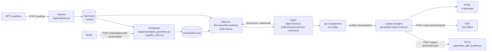

# PPTX Style Analyzer: обзор проекта

Документ описывает, какую задачу решает проект, как устроен пайплайн от загрузки
PPTX-шаблона до экспорта готовой презентации, как организован аудит качества и
какие результаты измерены на текущий момент (28.09.2026). Все числа в документе
либо измерены на реальных шаблонах из `output/`, либо взяты из отчётов о работе
над проектом; оценки помечены как оценки.

Содержание:

1. [Проблема](#1-проблема)
2. [Подход](#2-подход)
3. [Архитектура пайплайна](#3-архитектура-пайплайна)
4. [Архитектура аудита](#4-архитектура-аудита)
5. [Выводы](#5-выводы)

---

## 1. Проблема

Корпоративные презентации должны соответствовать фирменному шаблону: сетке,
полям, шрифтам, цветам, стилю карточек, графиков и таблиц. Генеративные модели
хорошо пишут текст, но не умеют надёжно верстать его в чужую дизайн-систему:
они не видят геометрию слайда, не знают, сколько строк займёт заголовок, и не
гарантируют, что текст не наедет на картинку или логотип.

Отсюда три практические проблемы:

- **Дизайн-система не описана явно.** Шаблон — это PPTX-файл с мастерами,
  макетами и примерами слайдов. Типографическая шкала, поля, стили компонентов и
  палитра графиков в нём не заданы как данные, их нужно восстановить.
- **Содержание и вёрстка смешаны.** Если поручить модели сразу и текст, и
  координаты, результат нестабилен и плохо проверяется.
- **Качество вёрстки нужно гарантировать.** Пользователь должен получать только
  чистые варианты: без переполнения, наложений, разрывов слов посередине,
  «висящих» одно-двухсимвольных строк и остатков чужого содержимого шаблона.

Проект решает задачу: **по PPTX-шаблону и текстовому брифу собрать редактируемую
презентацию в стиле шаблона, предложив по три проверенных варианта вёрстки для
каждого слайда.**

## 2. Подход

Задача разделена на независимые слои с явными контрактами данных между ними:

1. **Парсинг шаблона (детерминированный, без ML-моделей).** Backend разбирает
   PPTX (OOXML) и строит `report.json`: тему, типографику, палитру, каталог
   слайдов и макетов, найденные компоненты (карточки, KPI, таблицы, графики,
   диаграммы, цитаты, пагинацию), поля контента и кандидатов для титульного и
   финального слайдов.
2. **Генерация содержания (один запрос к LLM).** Модель получает бриф и краткую
   сводку о шаблоне и возвращает JSON презентации: для каждого слайда `intent`,
   `title` / `title_options`, `text` и типизированный `context` (абзацы, метрики,
   карточки, таблицы, графики и т. д.). Координат модель не выдаёт.
3. **Вёрстка (детерминированная, в браузере).** Frontend подбирает под данные
   компоненты и макеты шаблона, переносит компоненты, подставляет текст,
   нормализует текстовые области, прогоняет hit-test и выбирает до трёх
   разнообразных вариантов на слайд. Если реальных вариантов меньше трёх,
   добавляются резервные варианты из абзацев.
4. **Аудит.** Каждый кандидат проходит единые проверки компоновки. Кандидаты с
   ошибками отклоняются с явной причиной, а не «чинятся» молча.
5. **Экспорт.** Выбранные варианты сериализуются в формато-независимую сцену и
   собираются в редактируемый PPTX (python-pptx), PDF (LibreOffice) или HTML.

Ключевой принцип: **LLM отвечает только за содержание, геометрия и стиль берутся
из шаблона, а качество проверяется детерминированным кодом.**

## 3. Архитектура пайплайна

### 3.1. Общая схема



### 3.2. Слои и их границы

| Слой | Где выполняется | Основные модули | Вход | Выход |
|---|---|---|---|---|
| Парсинг | Backend (FastAPI) | `app/analyzer.py` и модули `app/*` | `source.pptx` | `report.json`, `assets/` |
| Генерация | Backend → Yandex AI Studio | `app/presentation_generator.py`, `app/llm_client.py`, `prompts/create_presentation.md` | бриф + сводка `report.json` | `presentation.json`, `llm_usage.json` |
| Вёрстка | Браузер (Web Worker) | `frontend/src/presentation/*`, `components/*`, `slides/*` | `report.json` + `presentation.json` | `previewVariants` (до 3 `catalogSlide` на слайд) |
| Аудит | Браузер, внутри вёрстки | `slide-hit-test.js`, `preview-layout-guard.js`, `build-scenario-preview-variants.js`, `layout-feedback.js` | кандидаты | `layout_validation`, причины отказа, `candidatePipeline` |
| Экспорт | Браузер → Backend | `generated-export-scene.js`, `export-generated-presentation.js`, `app/generated_export_scene.py`, `app/slides_pptx_builder.py`, `app/pptx_*_export.py` | выбранные варианты | `.pptx`, `.pdf`, `.html`, `generated-selection.json` |

Хранилище — файловая система: каждое задание получает каталог
`output/<job_id>/` (12-символьный hex), где лежат `source.pptx`, `report.json`,
`assets/`, `brief.txt`, `presentation.json`, `llm_usage.json` и
`generated-selection.json`.

### 3.3. Парсинг (`POST /analyze`)

Эндпоинт `analyze_upload` в `app/web.py` сохраняет файл в
`output/<job_id>/source.pptx` и вызывает `analyze()` из `app/analyzer.py`. При
любой ошибке каталог задания удаляется, а клиент получает HTTP 422 с текстом
«Не удалось проанализировать PPTX: …». Эндпоинт `POST /create-presentation`
объединяет анализ и (по флагу) генерацию в одном запросе.

Порядок шагов `analyze()`:

| Шаг | Модуль | Что извлекается |
|---|---|---|
| Чтение пакета | `app/pptx.py` | OOXML-части, связи, мастера, макеты, слайды |
| Ассеты | `app/assets.py` | изображения, SVG, перцептивные хэши (pHash) для дедупликации |
| Тема | `app/theme.py` | цветовая схема и шрифты темы |
| Типографика | `app/typography.py`, `app/text_slots.py`, `app/typography_usage.py`, `app/line_height.py` | шкала кеглей по семействам, текстовые блоки, вероятностные роли `body` / `slide_title` |
| Цвета | `app/colors.py`, `app/template_colors.py` | палитра, цвета текста и графики |
| Пространственные правила | `app/spatial_analysis.py` | отступы, свободные области, ритм повторов |
| Пагинация | `app/pagination_detection.py` | точки-пагинаторы, прогресс-бары, номера страниц |
| Шаблоны и каталог слайдов | `app/slide_templates.py`, `app/slide_catalog.py`, `app/template_layers.py` | макеты, слои, элементы каждого слайда с геометрией |
| Паттерны и компоненты | `app/slide_patterns.py`, `app/catalog_component_detection.py`, `app/visual_component_detection.py`, `app/structure_clustering.py` | повторяющиеся группы: карточки, списки, KPI, иконки |
| Семантика | `app/slide_semantics.py` | реестр компонентов, «оболочки» шаблонов |
| Поля контента | `app/content_margins.py` | медианные поля и зазор «заголовок → контент» |
| Инференс графики | `app/layout_table_inference.py`, `app/chart_region_inference.py`, `app/circular_chart_inference.py`, `app/diagram_region_inference.py`, `app/rectangle_radius_inference.py` | таблицы, графики, кольцевые диаграммы, схемы, радиусы скругления |
| Нарративные компоненты | `app/narrative_components.py` | цитаты, примеры кода |
| Титул и финал | `app/terminal_slide_candidates.py` | оценённые кандидаты для первого и последнего слайда |
| Графические базлайны | `app/graphic_components.py`, `app/graphic_baselines.py`, `app/chart_palette.py` | эталонные стили графиков и палитра серий |
| Статистика | `app/stats.py` | сводка для UI |

Методы детекции отдельных компонентов описаны в
`docs/component-detection-methods.md`, алгоритм типографики — в `README.md`.

### 3.4. Генерация (LLM)

- **Где вызывается:** `generate_presentation_from_brief()` в
  `app/presentation_generator.py` → `complete()` в `app/llm_client.py`.
- **Системный промпт:** `prompts/create_presentation.md` (читается через
  `app/prompts_loader.py`). Бриф по умолчанию — `prompts/default_breaf.md`.
- **Пользовательский промпт:** бриф плюс данные из `report.json`: список
  доступных визуальных семейств каталога и измеренные ограничения титульного и
  финального слайдов (`terminal_content_constraints`: максимальная длина
  короткого заголовка, поддержка персон).
- **Протокол:** OpenAI-совместимый Responses API Yandex AI Studio через SDK
  `openai`, `temperature=0.3`, JSON mode, параметр `reasoning.effort` передаётся
  только для моделей `gpt-oss`.
- **Один запрос на презентацию.** Модель сразу возвращает все слайды. Повторный
  вызов для того же задания возвращает сохранённый `presentation.json`
  (`"cached": true`).
- **Контракт ответа** после `normalize_presentation_contract()` и
  `validate_presentation_contract()`:
   - на уровне презентации: `title`, `goal`, `audience`, `slides[]`;
   - на уровне слайда: `index`, `intent` (одно из: title, section, problem,
     solution, metrics, features, process, comparison, timeline, roadmap, table,
     architecture, workflow, example, quote, team, summary, cta), `purpose`,
     `title_options` (`short` / `middle` / `long`, пустые варианты заполняются
     непустым; `title` = `middle`), `text`, `context`;
   - `context` содержит типы `paragraphs`, `metrics`, `cards`, `lists`,
     `timelines`, `icon_lists`, `tables`, `charts`, `diagrams`, `persons`,
     `quotes`, `snippets`, `images`.
- Учёт токенов пишется в `output/<job_id>/llm_usage.json` (`app/llm_usage.py`).

### 3.5. Вёрстка (frontend)

Точка входа лёгкого интерфейса — `frontend/lite.html` / `src/lite.js`. Сборка
всех слайдов выполняется в Web Worker `src/lite-assemble.worker.js`, который
последовательно вызывает `takeSlideVariants()` (`src/lite-assemble.js`) для
каждого слайда с общим контекстом покрытия. Полный аналитический интерфейс —
`index.html` / `src/main.js`.

Сборка одного слайда — `buildScenarioSlide()` в
`src/presentation/build-slide.js`:

| Этап | Модули | Суть |
|---|---|---|
| Нормализация | `slide-spec.js`, `slides/text-typographer.js` | ответ модели приводится к единому spec; типографская обработка текста (неразрывные пробелы) |
| Подбор компонентов | `match-relevant-components.js`, `component-semantics.js`, каталоги в `components/*-catalog.js` | для каждого непустого блока context — ранжированные подходящие компоненты |
| Совместимость «компонент × макет» | `component-template-fit.js` | заранее измеренный реестр: `status`, `max_count`, препятствия; кэшируется на объекте отчёта |
| Генерация кандидатов | `build-scenario-preview-variants.js`, `build-repeat-slide.js`, `build-metric-slide.js`, `build-text-slide.js`, `build-quote-slide.js`, `build-template-first-slide.js`, `build-title-decoration-slide.js` | для каждого блока свой пул кандидатов и локальный top-3 |
| Перенос компонента | `transplant-component-to-template.js` | компонент переносится на другую оболочку целиком, без изменения размеров; если не помещается — пара отбрасывается |
| Контракт метрик | `metric-contract.js`, `components/metric-render.js` | разбор значения и единицы KPI; неполные метрики не участвуют |
| Титул и финал | `build-terminal-slide.js`, `terminal-text-area.js`, `terminal-slot-style.js` | отдельный контракт (только title и text), нормализация текстовой области: свободный прямоугольник рядом со слотом, перенос и минимальный кегль |
| Финализация | `finalize-scenario-preview.js` | allowlist элементов, удаление старого содержимого и «остатков» компонентов донора (плашки, аватары, точки пагинации), материализация стилей графики |
| Hit-test | `slide-hit-test.js`, `text-measure.js`, `title-gap.js`, `separate-vertical-text.js` | измерение текста по «чернилам», исправление и валидация (см. раздел 4) |
| Отбор и разнообразие | `build-scenario-preview-variants.js` (`runScenarioVariantPipeline`, `selectDiverseVariants`), `component-coverage.js`, `placement-selection.js`, `scenario-priority.js` | preflight, ранжирование, три разных подложки, учёт уже показанных шаблонов по всей колоде |
| Резерв из абзацев | `paragraph-fallback.js`, `fillWithParagraphFallback` в `build-slide.js` | если вариантов меньше трёх, абзацы раскладываются в другие текстовые макеты или становятся карточками / пунктами списка |

Резервные варианты из абзацев (добавлены 28.09.2026):

- Абзацы — единственный тип данных, который есть всегда, поэтому они служат
  гарантированным источником вариантов.
- (a) Абзацы кладутся в другие текстовые макеты шаблона (до 4 доноров, по
  одному на шаблон, без уже использованных).
- (b) Абзацы становятся карточками или пунктами списка. Заголовок берётся из
  самого абзаца: часть до «: », « — », « – », «; », первое предложение или часть
  до запятой перед вводным словом придаточного. Если естественного разбиения
  нет, заголовок остаётся пустым: факты не придумываются.
- Резервные кандидаты проходят тот же пайплайн проверок, получают штраф
  `FALLBACK_SCORE_PENALTY = 60`, всегда стоят после реальных вариантов и
  помечаются полем `fallback: paragraph_text | paragraph_lists | paragraph_cards`.

Расхождения с `docs/slide-generation-pipeline.md`. Документ описывает основу
верно, но устарел в следующих местах:

- Проверки компоновки — теперь ошибки unit-based hit-test (`word_too_wide`,
  `text_orphan`, `title_gap`, пересечения, выход за поля), а не только
  предупреждения `text_overflow` / `text_overlap` из `preview-layout-guard.js`.
- Вариант `title_decor` строится только при наличии `images` в данных слайда
  (условие по intent `example` в коде больше не используется).
- Добавлены удаление остатков компонентов донора и резерв из абзацев. Резервные
  варианты не обходят проверки: они генерируются отдельным вызовом того же
  пайплайна и добавляются только после реальных вариантов.
- Рендерер больше не разрывает слова посередине (`word-break: normal`,
  `overflow-wrap: normal`) для обычного текста; ширина измеряется по таблицам
  метрик шрифтов, одинаковым для оценщика и hit-test.

### 3.6. Экспорт

| Формат | Где | Как |
|---|---|---|
| Редактируемый PPTX выбранных вариантов | `exportGeneratedPresentation(state, slides, 'pptx')` в `src/presentation/export-generated-presentation.js` → `POST /jobs/{job_id}/export-generated.pptx` | frontend готовит сцену (`generated-export-scene.js`), backend `app/generated_export_scene.py` задаёт порядок и размер слайдов, `app/slides_pptx_builder.py` собирает PPTX через python-pptx: нативные тексты, фигуры, таблицы, графики (`pptx_text_runs_export.py`, `pptx_table_export.py`, `pptx_fill_export.py`, `pptx_stroke_export.py`, `pptx_image_export.py`, `pptx_font_embed.py`, `pptx_paragraph_bullets.py`); сцена сохраняется в `generated-selection.json` |
| PDF | `POST /jobs/{job_id}/export-generated.pdf` | тот же PPTX конвертируется `soffice --headless --convert-to pdf` (таймаут 120 с); без LibreOffice — HTTP 503 |
| HTML | `exportHtml` в `export-generated-presentation.js` | автономный HTML в браузере: DOM-рендер сцены с инлайн-стилями и ресурсами |
| PPTX всего каталога шаблона | `GET /jobs/{job_id}/export-editable.pptx` (`src/slides/pptx-export.js`) | редактируемая пересборка разобранных слайдов шаблона |
| PPTX из картинок | `POST /jobs/{job_id}/export-slides.pptx` (`app/slides_export.py`) | превью-слайды как изображения (служебный режим) |

Формат сцены описан в `docs/generated-export-scene.md` (`version: 1`,
редактируемые примитивы, не скриншоты).

### 3.7. Контракты данных

| Контракт | Производитель → потребитель | Ключевые поля |
|---|---|---|
| `report.json` | парсинг → генерация, вёрстка, экспорт | `source`, `theme`, `assets`, `typography` (`type_scales`, `scale_usage`, `spatial`, `pagination`, `components`, `visibility.slide_size_pt`), `colors`, `slide_templates`, `slides` (`slides[]` с `content_elements`, `render.layers`, `patterns`), `layout.content_margins`, `slide_semantics`, `graphic_components`, `narrative_components`, `stats` |
| `presentation.json` | генерация → вёрстка | `presentation.title/goal/audience/slides[]`, у слайда `intent`, `title_options`, `text`, `context`, плюс `contract` (результат валидации) и `raw_text` |
| `previewVariants` | `buildScenarioSlide` → UI | до 3 вариантов: `catalogSlide` (элементы с `geometry_norm`, `typography`, `layout_validation`), `templateId`, `dataBlock`, `fallback`, диагностика `candidatePipeline` |
| `generated-selection.json` | frontend → backend экспорт | сцена `version: 1`: `render.layers`, `content_elements`, `geometry_pt/norm`, `z_index`, `slide_size_pt` |

### 3.8. Модели (MODELS)

| Модель | Тип | Где используется | Для чего | Ссылки |
|---|---|---|---|---|
| `gpt-oss-20b/latest` (текущее значение `YANDEX_CLOUD_MODEL` в `.env`; в `llm_usage.json` всех заданий — `gpt://<folder>/gpt-oss-20b/latest`) | LLM, открытые веса (OpenAI, Apache 2.0), используется **как API** Yandex AI Studio | `app/llm_client.py` ← `app/presentation_generator.py` | генерация JSON презентации по брифу | карточка модели: [huggingface.co/openai/gpt-oss-20b](https://huggingface.co/openai/gpt-oss-20b); API: [Yandex AI Studio](https://yandex.cloud/ru/docs/ai-studio/) |

Что **не** используется:

- Нейросетевых CV-моделей, OCR и эмбеддингов в коде нет. В `requirements.txt`
  нет torch, transformers, onnx и аналогов.
- «Компьютерное зрение» в проекте — геометрический и правиловый анализ OOXML
  (кластеризация по геометрии, стилям и повторам) и перцептивные хэши
  изображений (`ImageHash.phash` в `app/assets.py`, дедупликация ассетов).
- README упоминает разметчик изображений для SigLIP 2 (`siglip2-labeler/`), но
  такого каталога в репозитории нет, и SigLIP в коде не используется.
- Промпт `prompts/analyze_slide_content.md` в текущем коде не загружается.

Системные требования:

- Модель работает на стороне Yandex Cloud, локальный GPU не нужен. Для
  справки из карточек: gpt-oss-20b помещается примерно в 16 GB памяти.
- Приложение: образ `python:3.12-slim` (+ `librsvg2-bin`, `libimage-exiftool-perl`,
  `fontconfig`, `libreoffice-impress`); сборка frontend на `node:22-alpine`.
  Лимиты CPU и RAM в `docker-compose.yml` не заданы; точные требования не
  определены. Ориентир (оценка): браузер должен держать `report.json`
  размером 6–29 MB в памяти Web Worker.

### 3.9. Сетап

Требования: Docker (для контейнерного запуска) или Python 3.12 + Node.js 22
(для локальной разработки).

Python-зависимости (`requirements.txt`): `lxml`, `Pillow`, `ImageHash`,
`fonttools`, `fastapi`, `uvicorn[standard]`, `python-multipart`, `python-pptx`,
`httpx`, `python-dotenv`, `openai`. Frontend: `vite` (dev), `html-to-image`.

Запуск в Docker (один порт):

```bash
cp .env.example .env        # заполнить ключ и каталог Yandex Cloud
docker compose up -d --build
# UI: http://localhost:8000 (полный интерфейс), http://localhost:8000/lite
```

- Сервис `analyzer` публикует порт `8000`, читает `.env` (`env_file`) и
  монтирует `./output` в `/output`.
- Frontend собирается внутри образа и отдаётся FastAPI из `frontend/dist`.
- Код `app/` копируется в образ при сборке и не монтируется, поэтому после
  изменения backend нужна пересборка: `docker compose up -d --build`.

Локальная разработка (два порта):

```bash
python3 -m venv .venv
.venv/bin/pip install -r requirements.txt
.venv/bin/uvicorn app.web:app --reload --port 8000

cd frontend && npm ci && npm run dev    # http://localhost:5173
```

Vite проксирует `/analyze`, `/create-presentation`, `/prompts`, `/jobs`,
`/fonts` на `http://localhost:8000`.

Тесты:

```bash
cd frontend && node --test --test-reporter=spec \
  src/presentation/*.test.js src/components/*.test.js src/slides/*.test.js src/*.test.js
.venv/bin/python -m pytest -q tests
```

### 3.10. Переменные окружения

`.env` загружается модулем `app/env.py` (python-dotenv, из корня проекта) и
Docker Compose (`env_file`). Значения секретов в документе не приводятся.

| Переменная | Назначение | По умолчанию | Читается кодом |
|---|---|---|---|
| `YANDEX_CLOUD_API_KEY` | API-ключ Yandex AI Studio (секрет) | нет, обязательна | `app/llm_client.py` |
| `YANDEX_CLOUD_FOLDER` | идентификатор каталога Yandex Cloud; передаётся как `project` и подставляется в URI модели | нет, обязательна | `app/llm_client.py` |
| `YANDEX_CLOUD_MODEL` | модель: короткое имя (`gpt-oss-20b/latest`) или полный `gpt://…` URI | `qwen3-235b-a22b-fp8` | `app/llm_client.py` |
| `YANDEX_CLOUD_BASE_URL` | базовый URL OpenAI-совместимого API | `https://ai.api.cloud.yandex.net/v1` | `app/llm_client.py` |
| `YANDEX_TIMEOUT_SECONDS` | таймаут запроса к модели, с | `90` | `app/llm_client.py` |
| `YANDEX_MAX_OUTPUT_TOKENS` | лимит выходных токенов (у gpt-oss включает reasoning) | `25000` | `app/llm_client.py` |
| `YANDEX_REASONING_EFFORT` | `low` / `medium` / `high`, только для gpt-oss | `low` | `app/llm_client.py` |
| `OUTPUT_ROOT` | каталог заданий | `output` (в Docker `/output`, задан в `Dockerfile`) | `app/web.py` |
| `YANDEX_ENRICH_CONCURRENCY` | есть в `.env.example` и `.env` | `3` в примере | **не читается** текущим кодом |
| `YANDEX_API_URL`, `IAM_TOKEN`, `YANDEX_FOLDER_ID`, `MODEL_URI` | устаревшие имена в локальном `.env` | — | **не читаются** |

Frontend переменные окружения не использует.

### 3.11. Ограничения

- **Недетерминированность содержания.** LLM вызывается с `temperature=0.3`,
  поэтому повторная генерация по тому же брифу даёт другой текст. Внутри
  задания результат закэширован в `presentation.json`.
- **Измерение текста по таблицам метрик.** В Web Worker нет загруженных шрифтов
  и canvas-измерения, поэтому используются таблицы ширин глифов
  (`text-metrics-data.js`). Raleway аппроксимируется Montserrat. В backend-шрифтах
  нет алиаса Montserrat.
- **Таблицы и строки кода** по-прежнему допускают перенос внутри слова.
- **Склейка висящих строк** меняет текст: добавляется неразрывный пробел.
- **Пустой заголовок карточки.** Если у абзаца нет естественного разбиения на
  заголовок и тело, слот заголовка остаётся пустым.
- **Эвристики без эталонной разметки.** Роли типографики, компоненты, пагинация
  и регионы графиков определяются эвристиками с порогами уверенности; ошибки
  детекции возможны на нестандартных шаблонах.
- **Шаблоны с одним текстовым макетом** получают три варианта в основном за счёт
  резерва из абзацев.
- **Паритет форматов.** Сцена одна, но движки браузера, PowerPoint и LibreOffice
  по-разному рисуют шрифты. Пиксельных сравнительных тестов пока нет.
- **Эксплуатация.** Нет аутентификации и очистки `output/`. При ошибке анализа
  каталог задания удаляется вместе с исходным файлом, что затрудняет разбор
  инцидентов. Лимиты ресурсов в compose не заданы.

## 4. Архитектура аудита

### 4.1. Аудит в рантайме (AUDIT)

Аудит встроен в вёрстку и работает для каждого кандидата, а не только для
показанных вариантов.

| Уровень | Модуль | Проверки и действия |
|---|---|---|
| Совместимость до сборки | `component-template-fit.js` | `status=rejected` или `max_count=0` → пара не генерируется; препятствия макета (заголовок по реальному тексту, логотипы, картинки) |
| Hit-test и исправление | `slide-hit-test.js` (`resolveSlideLayout`, `detectLayoutIssues`) | элементы группируются в жёсткие юниты (карточка + текст + иконка); текст измеряется по «чернилам» (строки × интерлиньяж), а не по рамке |
| Слова и строки | `text-measure.js` + `fitWords` в `slide-hit-test.js` | переносы только между словами; порядок исправления: склейка висящей строки (≤ 2 символов) → расширение рамки в свободное место (с учётом плашки-контейнера, соседей и картинок, с сохранением выравнивания) → уменьшение кегля до минимального; слово шире рамки при минимальном кегле — ошибка `word_too_wide`, висящая строка — `text_orphan` |
| Зазор под заголовком | `title-gap.js` + `enforceTitleGap` | требуемый зазор `max(12, min(0.8·LH, 32))` pt, повышается до `min(0.75 · медиана шаблона, 1.0 · LH)`; медиана считается по слайдам того же шаблона; при нарушении контент сдвигается вниз, иначе заголовок вверх; неустранимое нарушение — ошибка `title_gap` |
| Разведение и поля | `separate-vertical-text.js`, `slide-hit-test.js` | разведение наложений, сдвиг в безопасную область, выход за слайд — жёсткая ошибка |
| Остатки донора | `collectComponentRemnantIds` в `finalize-scenario-preview.js` | удаляются плашки, аватары и пагинация компонентов, чей текст не используется; сохраняются фоны от 25 % площади, логотипы, рамки и явно запрошенные картинки; список пишется в `component_remnants_removed` |
| Preflight и quality gate | `runScenarioVariantPipeline` в `build-scenario-preview-variants.js`, `preview-layout-guard.js` | отклонение с причиной: `original_reference`, `invalid_layout` (с кодом ошибки), `placement_obstacle`, `placement_bounds`, `blocking_layout_warning` |
| Обратная связь по колоде | `layout-feedback.js` (`collectLayoutFeedback`) | сводка блокирующих проблем (`text_overflow`, `text_overlap`, `outside_slide`) по полям `title` / `text` / `context` |
| Диагностика | `candidatePipeline` в результате `buildScenarioSlide` | `generated`, `eligible`, `selected`, `contexts[]`, `rejected[]` с причинами: видно, чего не хватило — компонентов, места или разнообразия |

### 4.2. Тесты frontend (`node --test`)

Всего 68 тестовых файлов. Итоги по каталогам (прогон 28.09.2026):

| Каталог | Тестов | Прошло | Упало |
|---|---|---|---|
| `src/presentation/` | 215 | 215 | 0 |
| `src/components/` | 149 | 149 | 0 |
| `src/slides/` | 90 | 89 | 1 |
| `src/` | 5 | 4 | 1 |
| **Итого** | **459** | **457** | **2** |

Группы по назначению:

| Группа | Файлы | Что покрывает |
|---|---|---|
| Сборка слайда и отбор | `build-slide`, `build-scenario-preview-variants`, `placement-selection`, `scenario-priority`, `component-coverage`, `presentation-selection-summary`, `title-variant-selection`, `similar-templates`, `match-relevant-components`, `slide-spec`, `metric-variants-payload` | нормализация spec, подбор компонентов, локальные shortlist, ранжирование, разнообразие, учёт покрытия по колоде |
| Специальные слайды | `build-metric-slide`, `build-quote-slide`, `build-text-slide`, `build-template-first-slide`, `build-title-decoration-slide`, `build-terminal-slide`, `build-terminal-empty-templates`, `terminal-text-area`, `terminal-text-hit-test` | KPI, цитаты, текстовые и декоративные варианты, титул и финал, нормализация текстовых областей |
| Компоновка и качество текста | `slide-hit-test`, `preview-layout-guard`, `layout-feedback`, `separate-vertical-text`, `place-text-under-title`, `finalize-scenario-preview`, `component-template-fit`, `text-quality` | hit-test, переносы без разрыва слов, висящие строки, зазор под заголовком, удаление остатков, резерв из абзацев, реальные колоды ba2e и ac62 |
| Контракты данных | `metric-contract`, `graphic-contract`, `materialize-chart-styles`, `generated-export-scene` | формат KPI, графиков, стилей и сцены экспорта |
| Производительность | `assembly-speed` | сборка реальных колод за секунды, кэши детекции |
| Каталоги компонентов (`src/components/`) | `container-catalog`, `metric-catalog`, `table-catalog`, `image-catalog`, `singleton-catalog`, `pagination-catalog`, `narrative-catalog`, `slide-title-catalog`, `slide-description-catalog`, `vertical-repeat-text-catalog`, `component-semantics`, `from-vgroups`, `repeat-layout-analysis`, `table-style-pattern`, `baseline-template`, `fit-template-preview`, `model-data`, `container-render`, `metric-render` | построение каталога компонентов из отчёта и их рендер с данными модели |
| Детекторы и рендер (`src/slides/`) | `vgroup-detect`, `vgroup-partition`, `metric-detect`, `slide-title-detect`, `slide-layer-filter`, `chart-render`, `diagram-render`, `line-render`, `table-render`, `text-list`, `flex-layout`, `text-content-patch`, `text-typographer`, `pptx-export` | детекция групп, заголовков и метрик на слайдах, отрисовка графики и текста |
| Интеграция (`src/`) | `lite-assemble`, `lite-session` | сборка по всей презентации, сессия лёгкого UI |

Известные падения, не связанные с текущей работой:

1. `findSlideTitleElements uses spatial report when available`
   (`slides/slide-title-detect.test.js`) — нужен отсутствующий
   `output/625114b1c763`.
2. `every populated context builds a local shortlist before global selection`
   (`lite-assemble.test.js`) — утверждение «cards must generate candidates»
   проверяется на колоде 2a69, в которой нет карточек.

### 4.3. Тесты backend (`pytest`)

49 тестовых модулей в `tests/`. Прогон 28.09.2026 в локальном `.venv`:

- **Сбор тестов:** 273 теста собрано, 4 ошибки сбора. Модули
  `test_generated_pdf_export.py`, `test_llm_client.py`,
  `test_presentation_generator.py` и `test_web_create_presentation.py` не
  импортируются: в локальном `.venv` не установлен пакет `openai`. В Docker-образе
  он ставится из `requirements.txt`.
- **Прогон остальных модулей:** 177 прошло, 2 упало, 88 пропущено, 6 ошибок.
   - Упали: `test_table_styles.py::test_list_blank_stub_cells_marks_empty_header_corner`
     и `test_table_styles.py::test_table_recalculated_height_pt_prefers_content_when_larger`
     (`12.0 not greater than 12.0`).
   - Ошибки: `test_slide_connectors.py` (3) и `test_theme_colors.py` (3) ссылаются
     на отсутствующие `output/cb5ba5e5122e/source.pptx` и
     `output/9deb32f8cd1a/source.pptx`.
   - Пропуски: отсутствуют образцы колод и фикстуры (сообщения «sample deck report
     missing», «fixture missing»).

| Группа | Модули | Что покрывает |
|---|---|---|
| Парсинг и дизайн-система | `test_theme_colors`, `test_line_height`, `test_text_runs`, `test_text_group_spacing`, `test_fill_styles`, `test_shape_mask`, `test_shape_stroke`, `test_template_layers`, `test_slide_connectors`, `test_content_margins`, `test_rectangle_radius_inference`, `test_table_styles` | цвета темы и фона, интерлиньяж, runs, заливки, обводки, слои макетов, коннекторы, поля, радиусы, стили таблиц |
| Компоненты и структура | `test_catalog_component_detection`, `test_visual_component_detection`, `test_icon_column_filters`, `test_structure_clustering`, `test_slide_semantics`, `test_narrative_components`, `test_timeline_step_detection`, `test_terminal_slide_candidates`, `test_block_reservation`, `test_baseline_shell`, `test_graphic_elements`, `test_graphic_baselines`, `test_graphic_style_materialization`, `test_chart_palette` | детекция повторов, иконок, таймлайнов, цитат и кода, кандидатов титула, базлайнов графики и палитры |
| Инференс графики | `test_chart_region_inference`, `test_circular_chart_inference`, `test_diagram_region_inference`, `test_layout_table_inference`, `test_metric_text` | графики, кольцевые диаграммы, схемы, таблицы из разметки, текст метрик |
| Экспорт | `test_editable_slides_export`, `test_generated_export_scene`, `test_generated_slide_export`, `test_generated_pdf_export`, `test_slides_export`, `test_pptx_fill_export`, `test_pptx_font_embed`, `test_pptx_image_export`, `test_pptx_paragraph_bullets`, `test_pptx_stroke_export`, `test_pptx_table_export`, `test_text_multiline_export`, `test_text_wrap_export` | сборка PPTX и PDF, встраивание шрифтов, таблицы, маркеры, переносы |
| LLM и API | `test_llm_client`, `test_llm_usage`, `test_presentation_generator`, `test_web_create_presentation` | клиент Responses API, учёт токенов, нормализация контракта, эндпоинты |
| Инфраструктура | `test_text_revision_service` | версионирование промптов (`.prompt-history`) |

### 4.4. Измерение качества на реальных шаблонах

Кроме unit-тестов, качество измерялось сквозным прогоном сборки на 12 заданиях
из `output/` (5 уникальных шаблонов, разные брифы; 140 слайдов). Для каждого
показанного варианта проверялись: ошибки `layout_validation`, слово шире рамки,
висящая строка, зазор под заголовком, остатки донора, дубли строк в текстовых
группах. Скрипты замеров лежали во временном каталоге и в репозиторий не
входят; постоянные проверки на реальных колодах есть в `text-quality.test.js`
и `assembly-speed.test.js`.

## 5. Выводы

### 5.1. Обоснованность архитектуры пайплайна

- Разделение «парсинг → генерация → вёрстка → аудит → экспорт» совпадает с
  природой неопределённости: геометрия и стиль известны точно (их даёт шаблон),
  содержание вероятностно (его даёт LLM). Детерминированный код отвечает за всё,
  что можно проверить.
- LLM не выдаёт координаты, поэтому ошибки модели ограничены содержанием, а
  вёрстку можно тестировать без модели на сохранённых `presentation.json`.
- Все кандидаты проходят один пайплайн проверок: специальные стратегии (титул,
  декор, резерв из абзацев) не могут обойти quality gate.
- Сборка вынесена в браузерный Web Worker: интерфейс не блокируется, а backend
  не хранит состояние вёрстки.

### 5.2. Декомпозиция задачи

| Подзадача | Решение |
|---|---|
| Восстановить дизайн-систему | ~20 специализированных модулей анализа, каждый пишет свой раздел `report.json` |
| Написать содержание | один промпт, строгий типизированный контракт `context` и валидация |
| Подобрать компонент под данные | семантический матчинг по каждому блоку context независимо |
| Разместить компонент | реестр «компонент × макет» с измеренными препятствиями и переносом без масштабирования |
| Гарантировать качество | hit-test с исправлением, затем валидация с причинами отказа |
| Обеспечить выбор | три варианта на разных подложках с учётом покрытия по колоде |
| Выдать результат | формато-независимая сцена и адаптеры PPTX / PDF / HTML |

### 5.3. Работа с неопределённостью

- **Пустые текстовые поля шаблона.** Макеты с пустыми плейсхолдерами
  становятся кандидатами для титула и финала, если для слота удаётся вывести
  стиль; они ранжируются ниже равноценных заполненных (`build-terminal-slide.js`).
- **Недостаток данных.** Неполные KPI попадают в `metric_issues` и не
  участвуют в сборке. При нехватке вариантов используется резерв из абзацев,
  без выдумывания фактов.
- **Отказ с причиной вместо молчаливой порчи.** Каждый отклонённый кандидат
  получает код (`invalid_layout: text_orphan`, `placement_obstacle` и т. д.), а
  неустранимые проблемы вёрстки остаются ошибками.
- **Пороги уверенности.** Пагинация засчитывается от 2 слайдов и при оценке
  уверенности ≥ 0.55; если активная точка не найдена, используется нейтральное
  качество 0.45. Роль `body` показывается при уверенности ≥ 20 %. Висящая
  строка — не более 2 символов. Резервные варианты штрафуются на 60 баллов.
- **Защита от пустых данных в анализе.** 28.09.2026 исправлено падение анализа
  шаблона «Tech Trends 2026 by Slidesgo» (`no median for empty data` в
  `app/pagination_detection.py`): ряды точек без активной точки больше не
  приводят к медиане пустого списка.

### 5.4. Качество парсинга шаблонов и извлечения дизайн-системы

- Типографика строится из видимого текста слайдов с откатом на мастера и макеты,
  шкала кеглей объединяет близкие размеры (±2.5 %), роли определяются
  вероятностно (softmax по признакам использования).
- Зазор «заголовок → контент» выучивается из самого шаблона (медиана по
  слайдам того же макета) и применяется при вёрстке.
- Компоненты детектируются по повторяемости геометрии, стилей и слотов;
  графики, таблицы и диаграммы восстанавливаются из разметки, в том числе когда
  они нарисованы фигурами, а не нативными объектами.
- Ограничение: качество детекции не измерено на размеченном датасете, оценка
  идёт через итоговую вёрстку и тесты на реальных колодах.

### 5.5. CV- и LLM-оркестрация

- Нейросетевого CV нет: визуальный анализ — геометрия OOXML и pHash.
- LLM вызывается один раз на презентацию, с JSON mode, измеренными
  ограничениями титула и списком доступных визуальных семейств шаблона. Ответ
  нормализуется и валидируется.
- Ошибки конфигурации (нет ключа или каталога) возвращают HTTP 503, ошибки
  модели — 422 с текстом. Обрезанный ответ распознаётся до парсинга.

### 5.6. Воспроизводимость

- **Детерминированная вёрстка.** Выбор при равных оценках стабилен для seed
  `«название|номер слайда|intent»`; одинаковые `report.json` и
  `presentation.json` дают одинаковые варианты.
- **Детерминированный анализ.** Повторный анализ `output/5f31d1d84d52/source.pptx`
  28.09.2026 дал отчёт, полностью совпадающий с сохранённым (0 различий при
  сравнении по всем полям).
- **Кэширование.** `presentation.json` кэшируется на задание; внутри вёрстки
  кэшируются реестр совместимости, детекция групп, каталог метрик, переносы
  строк (кэш `wrapText`), медианы зазоров.
- **Окружение.** Docker-образ с зафиксированными версиями Python-пакетов;
  версии промптов хранятся в content-addressed истории (`.prompt-history/`).
- **Тесты на реальных колодах** для сборки, скорости и качества текста.
- Недетерминирован только текст модели (`temperature=0.3`).

### 5.7. Эффективность решения

| Этап | Показатель | Источник |
|---|---|---|
| Вёрстка всей колоды (12 заданий, 29–55 слайдов в шаблоне, 5–13 слайдов в сценарии) | 0.2–1.1 с на колоду | измерено 28.09.2026 |
| Вёрстка до оптимизаций и кэширования | до ~14 мин на колоду | предыдущие отчёты профилирования |
| Анализ «Tech Trends 2026» (7.4 MB, 32 слайда) | 14.4 с | измерено 28.09.2026, локальный `.venv` |
| Анализ `5f31` (23.9 MB, 55 слайдов) | 2.3 с | измерено 28.09.2026, локальный `.venv` |
| Анализ шаблонов около 30 MB | ~26–34 с | предыдущие отчёты |
| Запрос к LLM | ~10–25 с | предыдущие отчёты |
| Токены LLM на презентацию | ~7.9 тыс. входных, ~1.2–4.0 тыс. выходных | `output/*/llm_usage.json` |
| Размер `report.json` | 6–29 MB на шаблон | `output/*/report.json` |

Из-за разного объёма графики и компонентов время анализа слабо зависит от
размера файла: оно определяется числом и сложностью слайдов.

### 5.8. Качество итоговых презентаций

Замеры 28.09.2026 на 12 заданиях (140 слайдов), до и после сегодняшних изменений
(переносы без разрыва слов, висящие строки, выученный зазор под заголовком,
удаление остатков донора, резерв из абзацев):

| Показатель | До | После |
|---|---|---|
| Показанных вариантов | 400 | 420 |
| Слайдов с менее чем 3 вариантами | 13 из 140 | 0 из 140 |
| Ошибок `layout_validation` в показанных вариантах | 0 | 0 |
| Слово шире рамки (разрыв слова в рендере) | 26 | 0 |
| Слишком маленький зазор под заголовком | 92 | 1 (ложное срабатывание измерительного скрипта: сравнение по рамке, а не по тексту) |
| Остатки компонентов донора | 26 | 2 (намеренные фотографии в варианте «заголовок и картинки шаблона») |
| Висящие строки из 1–2 символов | 4 | 0 |
| Дубли текста в строках одной группы | — | 0 (исправлено дублирование абзаца в карточках с многострочным телом) |

Резервные варианты использованы 21 раз (13 карточек, 8 других текстовых
макетов), только в двух шаблонах с единственным текстовым макетом. Все они
стоят после реальных вариантов. Время сборки колоды осталось в пределах
0.2–1.1 с.

### 5.9. Итог

Проект превращает PPTX-шаблон в машиночитаемую дизайн-систему, отдаёт LLM
только содержание и собирает слайды детерминированным кодом с обязательным
аудитом. На текущем наборе шаблонов каждый слайд получает три чистых варианта,
вёрстка колоды занимает около секунды, а экспорт даёт редактируемый PPTX.

Основные направления развития:

- измерение текста реальными шрифтами;
- пиксельные тесты паритета PPTX / PDF / HTML;
- размеченный датасет для оценки детекторов;
- восстановление отсутствующих фикстур backend-тестов;
- очистка `output/` и сохранение исходника при ошибке анализа.
